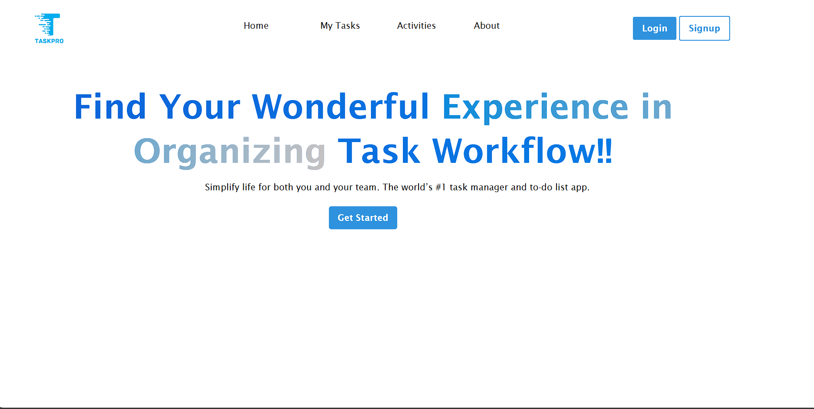
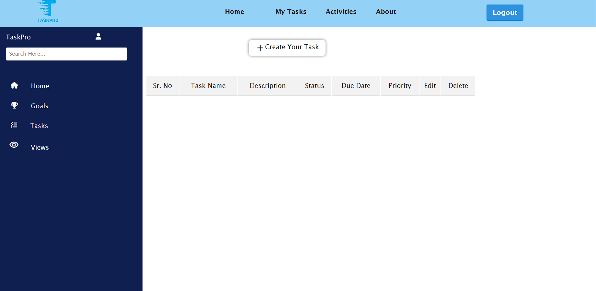
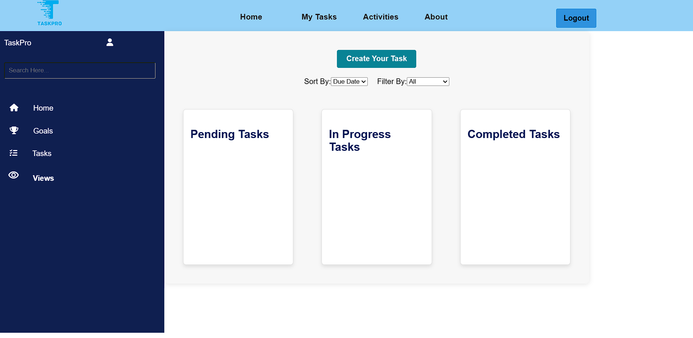
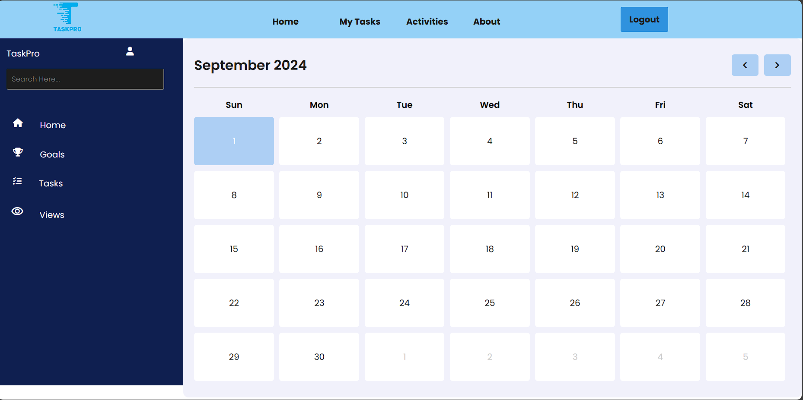
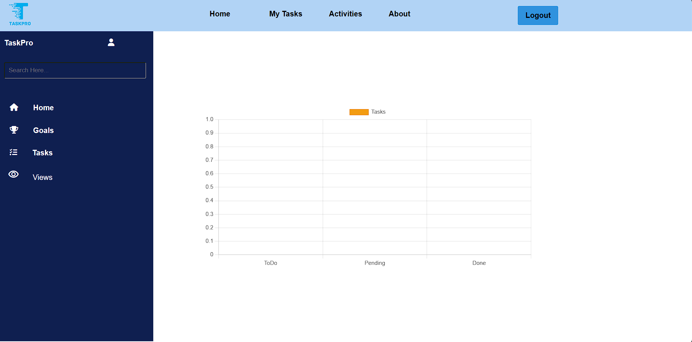

# Algorithm Visualizer

## Introduction
The Task Management Website is a user-friendly platform designed to help individuals and teams organize, manage, and track their tasks efficiently. The application allows users to create, assign, and monitor tasks, ensuring better productivity and project management.

## Project Type
Frontend,Backend

## Deployed App
- [Live Demo on Netlify](https://incomparable-jalebi-1ecef7.netlify.app/)

## Directory Structure
<pre>

|   index.html
|   README.md
|   structure.txt
|
+---footer-design
|   |   index_footer.html
|   |   script_footer.js
|   |   style_footer.css
|   |
|   \---img
|           aditya_thakur.jpg
|           Ashita_shahu.jpg
|           logo.png
|           myPice2.png
|           Professional image prakash singh.jpg
|           Sayan_roy.jpg
|
+---html
|       graph.html
|       tableView.html
|       task.html
|
+---images
|   |   Blue_3D_Abstract_Letter_S_Logo-removebg-preview.png
|   |   taskImage.png
|   |
|   \---img
|           Blue 3D Abstract Letter S Logo.png
|           logo-1.png
|           logo-2.png
|           logo-3.jpeg
|           logo-4.jpeg
|           logo-5.png
|           logo-6.jpeg
|           logo-7.png
|           logo-8.png
|           logo-9.png
|           todo-1.jpg
|           todo-2.webp
|           todo-3.jpeg
|
+---login&sign_up
|   |   index.html
|   |   script.js
|   |   style.css
|   |
|   \---img
|           login.svg
|           login2.svg
|           login_rep.svg
|           logo.png
|
+---script
|       task.js
|
\---styles
        styles.css
        tableView.css
        task.css
</pre>


## Video Walkthrough of the Project
- [Project Features Walkthrough](https://youtu.be/YYwPCnWZOlE)

## Project Questionnaires
- [Project Questionnaires](https://youtu.be/wvg-0XNGnB4)


## Features

- **Task Management**: Allows users to create, prioritize, and track tasks with deadlines.
- **Team Collaboration**: Facilitates teamwork by enabling task assignments and progress tracking for teams.
- **Time Tracking**: Helps users monitor the time spent on each task to improve productivity.
- **Custom Workflows**: Users can create and customize workflows to fit their specific project needs.
- **Project Reporting & Analytics**: Provides insights into project performance and progress.
- **Integration with Third-Party Tools**:  Supports integration with tools like Google Calendar, Slack, and more.
- **Responsive Design**: Ensures a seamless experience across devices, including desktops, tablets, and smartphones.

## Design Decisions and Assumptions
- **JavaScript for Algorithm Implementation:** Utilizes JavaScript to handle the core task management functionalities, ensuring dynamic user interaction.
- **Interactive UI:** Built with HTML, CSS, and JavaScript for a smooth and intuitive user experience.
- **Minimalistic Design:** Structured to be easily extendable for future enhancements and features.

## Installation & Getting Started
To set up and run the project locally:

1. Clone the repository:
   ```bash
   git clone https://github.com/sayanroy-bash/Array-Archers_023.git

2. Navigate to the project directory:
   ```bash
   cd Array-Archers_023

## Usage
Open index.html in your web browser to start the visualizer.

## Credentials
No authentication is required for this application.

## APIs Used
No external APIs are utilized in this project.

## Technology Stack

### Core Technologies
- **HTML**: Provides the structure of the web pages.
- **CSS**: Stylesheets for visual styling and layout.
- **JavaScript**: Adds interactivity and dynamic behavior to the visualizations.

### Usage

For the Task Management website, the core technologies utilized are HTML, CSS, and JavaScript, which form the backbone of the site's structure, styling, and functionality. This is enhanced by Bootstrap to ensure a responsive and user-friendly design across various devices. Additionally, the website leverages jQuery for simplified DOM manipulation and AJAX for asynchronous data handling. To manage and visualize tasks efficiently, the project incorporates local storage for data persistence and Chart.js for graphical representation of task statistics and progress.


## Screenshots






